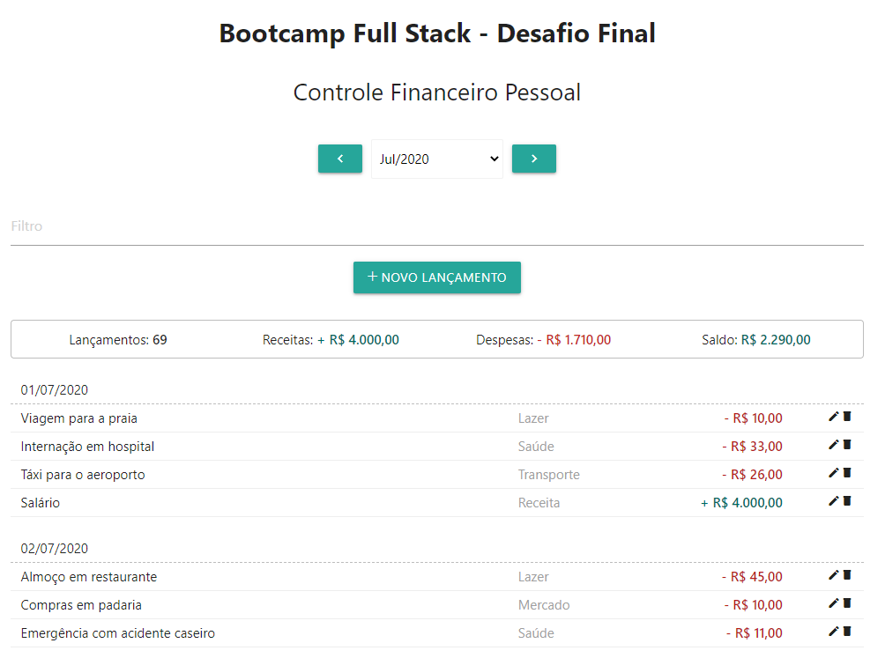

# Desafio Final BootCamp FullStack - IGTI

Desafio final do bootcamp Desenvolvedor Full Stack do Instituto de Gestão e Tecnologia da Informação.

## Objetivo

Exercitar os conteitos trabalhados nos módulos do bootcamp:
- Implementação de algoritmos com **JavaScript**.
- Criação de API com **Node.js** e **Express**.
- Criação de componentes com **React** com Functional Components.
- Persistência de dados com **MongoDB** e **Mongoose**.
- Implantação de aplicações web com **Heroku**

## Enunciado

Criar uma aplicação web para **Controle Financeiro Pessoal** com MongoDB + Node.JS + React e implantação no Heroku.

## Deploy

Veja o aplicativo em execução no Heroku:
### http://personalnerd-desafio-final.herokuapp.com
